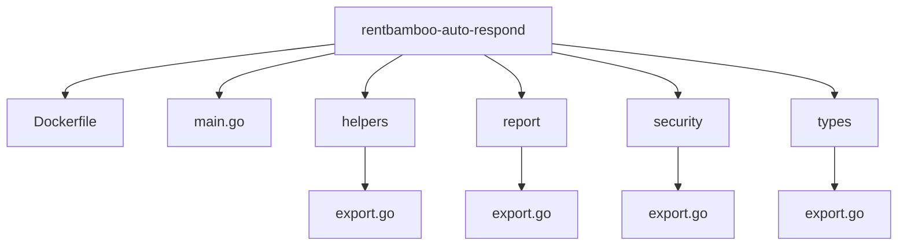

# File structure



# Getting Started

## Prerequisites
- Go (version 1.22.5 or later)
- Docker (optional, for containerization)
- Git

## Setting up the development environment
1. Install Go from the official website: https://golang.org/
2. Install Docker if you plan to use containerization: https://docs.docker.com/get-docker/
3. Install Git: https://git-scm.com/downloads

## Running the app locally
1. Clone the repository
   ```
   git clone https://github.com/yourusername/rentbamboo-auto-respond.git
   cd rentbamboo-auto-respond
   ```

2. Install dependencies
   ```
   go mod download
   ```

3. Configure environment variables
   - Create a `.env` file in the project root
   - Add necessary environment variables (e.g., database connection strings, API keys)

4. Run go vet to check for potential issues
   ```
   go vet ./...
   ```

5. Format the code using go fmt
   ```
   go fmt ./...
   ```

6. Build the application
   ```
   go build -o rentbamboo-auto-respond
   ```

7. Start the application
   ```
   ./rentbamboo-auto-respond
   ```

# Steps to deploy

## Preparing for deployment
- Run go vet
  ```
  go vet ./...
  ```
- Format the code
  ```
  go fmt ./...
  ```
- Build the application
  ```
  go build -o rentbamboo-auto-respond
  ```
- Test the build
  ```
  ./rentbamboo-auto-respond
  ```

## Deploying the app to Fly.io
1. Install Fly CLI
   ```
   curl -L https://fly.io/install.sh | sh
   ```

2. Authenticate with Fly.io
   ```
   fly auth login
   ```

3. Configure deployment settings
   - Create a `fly.toml` file if not present
   - Adjust settings as needed

4. Deploy the application
   ```
   fly deploy
   ```

5. Verify the deployment
   ```
   fly status
   ```

6. Ensure it builds locally first before deploying
   ```
   go vet ./...
   go fmt ./...
   go build -o rentbamboo-auto-respond
   ./rentbamboo-auto-respond
   ```
   If successful, proceed with `fly deploy`

   7. .Env file
ask for bash script to add secrets to fly.io


```

This skeleton code provides a foundation for the email scanning tool. You'll need to implement the actual email scanning logic in the `ScanEmails` method, which should:

1. Connect to the email server using IMAP
2. Check for new emails
3. Parse email content and sender
4. Use `IsLeadEmail` to determine if it's a lead
5. Process leads using `ProcessLead`

To complete the implementation, you'll need to:

1. Add proper error handling
2. Implement IMAP connection and email fetching
3. Add proper email parsing
4. Implement lead processing logic
5. Add configuration management
6. Add logging
7. Add metrics/monitoring

Additional considerations:

1. Use environment variables for sensitive information
2. Add retry logic for failed operations
3. Implement proper email filtering
4. Add rate limiting to avoid overwhelming the email server
5. Implement proper cleanup of processed emails

You'll also need to add these dependencies to your `go.mod`:
